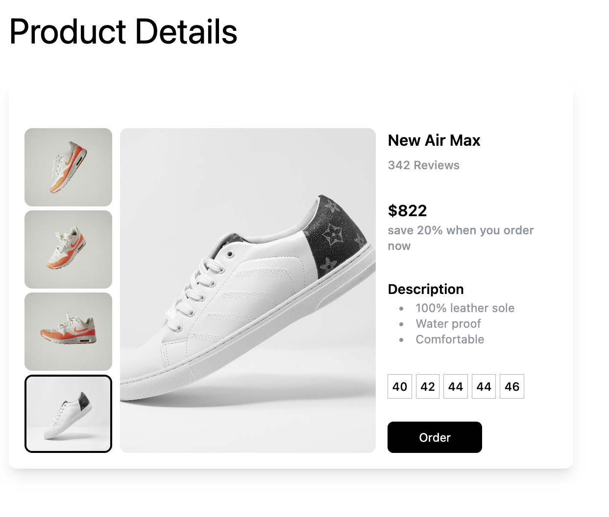
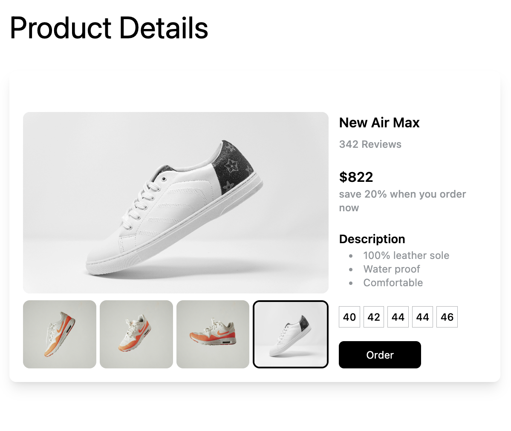

# PRODUCT DETAILS DOCUMENTATION

A product details view component which has two types of image layout created with NextJs v14 and tailwind css.

## IMAGES/VIDEO




VIEW ON CODEPEN : [https://codepen.io/Developer-Renaissance/pen/qBzBwgM]

### HOW TO USE

1. Install Nextjs and tailwind in your project, `[NextJs Doc]` `(https://nextjs.org/docs/getting-started/installation)`

2. Copy source code from /gallery-slider/components/Product-Details.js

3 Props

(I) **array of Images (Compulsory)** (which is an array of objects with image, see data.js file, emulate the object structure.).

```
   const images = [
     {
      id: 1,
      src: 'https://images.unsplash.com/photo-1600185365926-3a2ce3cdb9eb',
    },
    {
      id: 2,
      src: 'https://images.unsplash.com/photo-1600185365483-26d7a4cc7519',
    },
    ]
  ...

```

(II) **link(compulsory)** The CTA can be either a button or a link. If the link prop is provided, you are to add the href={} prop and if the link prop is not provided, it would default to a button which would require you to provide the action prop that is added to the button's onClick.

(III) **ctaText(optional)** Whether it is a button or a link, you are to provide a ctaText which is a string.

(IV) **changeView(optional)** This props give you access to the two layout changes of the product images. If true, the images will be laid as this:


It is true by default.

### HOW TO CONTRIBUTE

Contributions are welcome! If you have an idea for improvement or have found a bug, please open an issue or submit a pull request.
